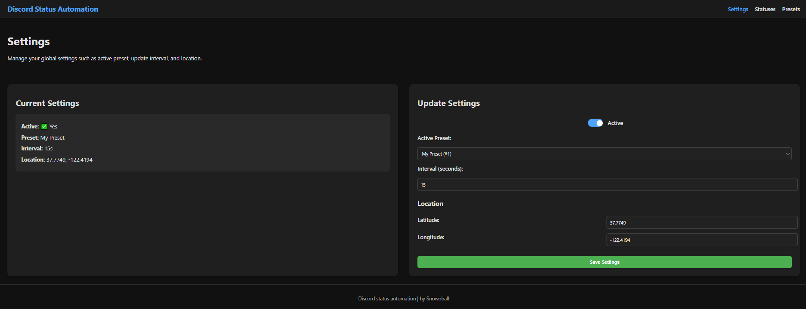
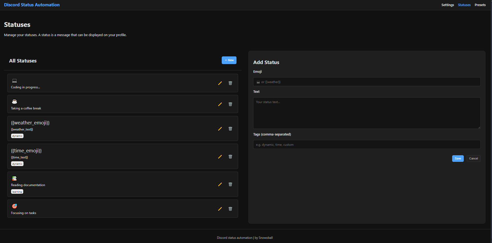
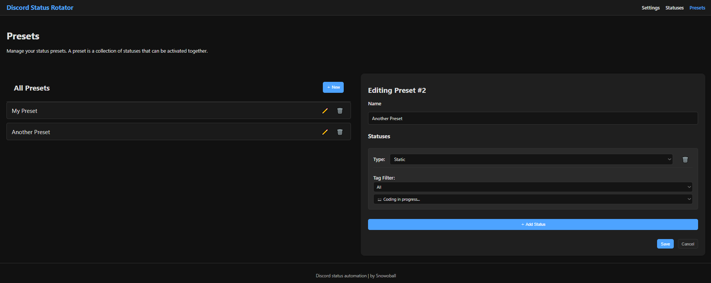

# Discord Status Automator

[](https://discord.com/users/357480640415006720)

This project is inspired by
[RELIHR/Discord-Status-Rotator](https://github.com/RELIHR/Discord-Status-Rotator)
and aims to provide a fully automated, dynamic Discord status rotator with
optional web configuration for creating custom statuses with dynamic
placeholders.

---

## Features

- **Modular status rotation system** with extensible sequence types
- **Built-in sequence types:**
  - `static` - Display a single status
  - `random` - Randomly pick from multiple statuses
  - `none` - Clear the status
  - `schedule` - Show status only during specific time range
  - `weekday` - Show status only on specific days of the week
  - `conditional` - Combine weekday AND time range conditions
- **Dynamic placeholders:**
  - `{{time_emoji}}` / `{{time_text}}` - Day phase based on your location and timezone
  - `{{timestamp_text}}` - Current time (HH:MM AM/PM) in your timezone
  - `{{weather_emoji}}` / `{{weather_text}}` - Current weather at your location
- **Web configuration UI** for creating/editing presets and statuses
- **Timezone support** - All time-based features use your configured timezone
- **Hot-reload configuration** - Changes apply without restart
- Built-in toggle for web UI (`NO_WEB=true/false`) for server environments
- Runs locally with Go or with Docker

---

## Disclaimer

- This tool is intended for personal use.
- It operates as a self-bot by automating your Discord account’s status — **use
  at your own risk**.
- Misuse or violating Discord's Terms of Service is your responsibility.

---

## Web Configuration Service

- Runs on port `8080` (configurable in Docker / Go environment)
- Provides an interface to:
  - Add or edit statuses with dynamic placeholders
  - Create presets with modular sequence types
  - Configure timezone and location settings
  - Toggle the service on/off
- **Configuration file:** `configuration/config.json` (single unified file)
- Changes are automatically applied when you edit the file while running
- **Timezone configuration:** Set your timezone in settings for accurate time-based sequences
- **Location (optional):** Only required for weather placeholders (`{{weather_emoji}}`, `{{weather_text}}`)

---

## Configuration

- **Single config file:** `configuration/config.json`
  - `settings` — Active preset, interval, timezone, and location
  - `statuses` — Individual statuses with emoji/text and tags
  - `presets` — Sequences using modular type system
- Changes are automatically hot-reloaded without restart
- **Timezone:** Required for time-based sequence types (schedule, weekday, conditional)
- **Location:** Optional, only needed for weather-based placeholders

## Images

> Settings 

> Statuses 

> Presets 

---

## Getting Started

### 1. Clone the Repository

Install Git or download the repository as a ZIP:

```bash
# Using git
git clone https://github.com/snowoball/discord-status-automation.git
cd discord-status-automation
```

Or download the ZIP and extract.

---

### 2. Setup Environment Variables

1. Copy `.example-env` to `.env`:

```bash
cp .example-env .env
```

2. Replace placeholders with your Discord token(s):

```
DISCORD_TOKENS=token1,token2,...
```

---

## Usage

### Option 1: Docker 🐳 (Recommended)

If you’ve never used Docker, here’s a quick overview:

1. **Install Docker**

   - **Windows / macOS:** Download Docker Desktop from
     [https://www.docker.com/get-started](https://www.docker.com/get-started)
   - **Linux:** Install via your package manager (e.g.,
     `sudo apt install docker.io` on Ubuntu)

2. **Start Docker**

   - On Windows/macOS, launch Docker Desktop.
   - On Linux, make sure the Docker daemon is running
     (`sudo systemctl start docker`).

Build the Docker image:

```bash
docker build -t auto-discord-status .
```

Run with webserver enabled (recommended):

```bash
# Linux / Bash
docker run -d --name auto-discord-status -p 8080:8080 -v $(pwd)/configuration:/app/configuration --env-file .env --restart unless-stopped -e NO_WEB=false auto-discord-status

# Windows PowerShell
docker run -d --name auto-discord-status -p 8080:8080 -v ${PWD}\configuration:/app/configuration --env-file .env --restart unless-stopped -e NO_WEB=false auto-discord-status
```

> ⚠️ Using the `-v $(pwd)/configuration:/app/configuration` flag ensures your
> local configuration files stay linked to the container. This allows you to
> edit presets or statuses directly in your repository and keep changes
> persistent even after rebuilding the image.

> If you want to run the container without an active webserver (for
> server-envoirnoments) you should set `NO_WEB=true` and remove the
> `-p 8080:8080`

Stop and remove container:

```bash
docker stop auto-discord-status
docker rm auto-discord-status
```

---

### Option 2: Running Locally with Go for testing and development

Ensure [Golang](https://go.dev) is installed. Then, in the repository:

```bash
# Run with webserver enabled (default | recommended)
go run main.go

# Run without webserver
go run main.go --no-web
```

---

## Contributing

Contributions are welcome!

- Fork the repository.
- Make your changes.
- Open a pull request with a clear description.
