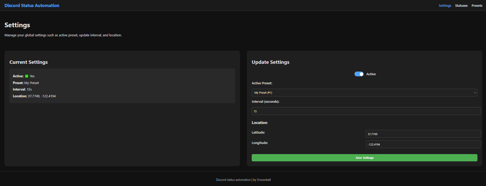

# Discord Status Automator

[](https://discord.com/users/357480640415006720)

This project is inspired by
[RELIHR/Discord-Status-Rotator](https://github.com/RELIHR/Discord-Status-Rotator)
and aims to provide a fully automated, dynamic Discord status rotator with
optional web configuration for creating custom statuses with dynamic
placeholders.

---

## Features

- Rotate Discord status emoji and text automatically based on configurable
  presets.
- Supports dynamic placeholders:

  - `{{time_emoji}}` / `{{time_text}}`
  - `{{timestamp_text}}` (current HH:MM AM/PM)
  - `{{weather_emoji}}` / `{{weather_text}}`
- Web configuration server for creating/editing presets and statuses.
- Built-in toggle for web configuration (`NO_WEB=true/false`) for server
  envoirnoments.
- Runs locally with Go or with Docker.

---

## Disclaimer

- This tool is intended for personal use.
- It operates as a self-bot by automating your Discord account’s status — **use
  at your own risk**.
- Misuse or violating Discord's Terms of Service is your responsibility.

---

## Web Configuration Service

- Runs on port `8080` (configurable in Docker / Go environment).
- Provides an interface to:

  - Add or edit statuses
  - Create presets
  - Use dynamic placeholders like `{{weather_emoji}}` or `{{time_text}}`
  - Toggle the service on/off
- Configuration is saved in the `configuration` folder (`settings.json`,
  `presets.json`, `statuses.json`).
- Default files can be reset if needed - just replace them from the repo
  defaults.

---

## Configuration

- `configuration/settings.json` — controls active preset, interval, and
  location.
- `configuration/presets.json` — defines sequences and types of statuses.
- `configuration/statuses.json` — stores individual statuses and their
  emoji/text.
- Changes are automatically applied if you edit files while the container or Go
  service is running.

## Images

> Settings 

> Statuses 

> Presets 

---

## Getting Started

### 1. Clone the Repository

Install Git or download the repository as a ZIP:

```bash
# Using git
git clone https://github.com/snowoball/discord-status-automation.git
cd discord-status-automation
```

Or download the ZIP and extract.

---

### 2. Setup Environment Variables

1. Copy `.example-env` to `.env`:

```bash
cp .example-env .env
```

2. Replace placeholders with your Discord token(s):

```
DISCORD_TOKENS=token1,token2,...
```

---

## Usage

### Option 1: Docker 🐳 (Recommended)

If you’ve never used Docker, here’s a quick overview:

1. **Install Docker**

   - **Windows / macOS:** Download Docker Desktop from
     [https://www.docker.com/get-started](https://www.docker.com/get-started)
   - **Linux:** Install via your package manager (e.g.,
     `sudo apt install docker.io` on Ubuntu)

2. **Start Docker**

   - On Windows/macOS, launch Docker Desktop.
   - On Linux, make sure the Docker daemon is running
     (`sudo systemctl start docker`).

Build the Docker image:

```bash
docker build -t auto-discord-status .
```

Run with webserver enabled (recommended):

```bash
# Linux / Bash
docker run -d --name auto-discord-status -p 8080:8080 -v $(pwd)/configuration:/app/configuration -e NO_WEB=false auto-discord-status

# Windows PowerShell
docker run -d --name auto-discord-status -p 8080:8080 -v ${PWD}\configuration:/app/configuration -e NO_WEB=false auto-discord-status
```

> ⚠️ Using the `-v $(pwd)/configuration:/app/configuration` flag ensures your
> local configuration files stay linked to the container. This allows you to
> edit presets or statuses directly in your repository and keep changes
> persistent even after rebuilding the image.

> If you want to run the container without an active webserver (for
> server-envoirnoments) you should set `NO_WEB=true` and remove the
> `-p 8080:8080`

Stop and remove container:

```bash
docker stop auto-discord-status
docker rm auto-discord-status
```

---

### Option 2: Running Locally with Go for testing and development

Ensure [Golang](https://go.dev) is installed. Then, in the repository:

```bash
# Run with webserver enabled (default | recommended)
go run main.go

# Run without webserver
go run main.go --no-web
```

---

## Contributing

Contributions are welcome!

- Fork the repository.
- Make your changes.
- Open a pull request with a clear description.
